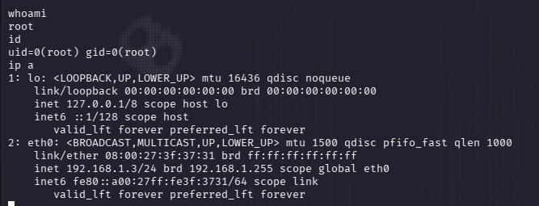
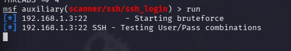
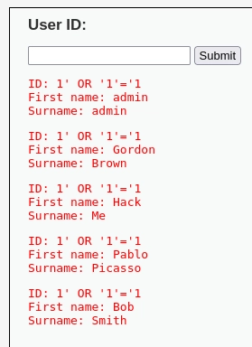
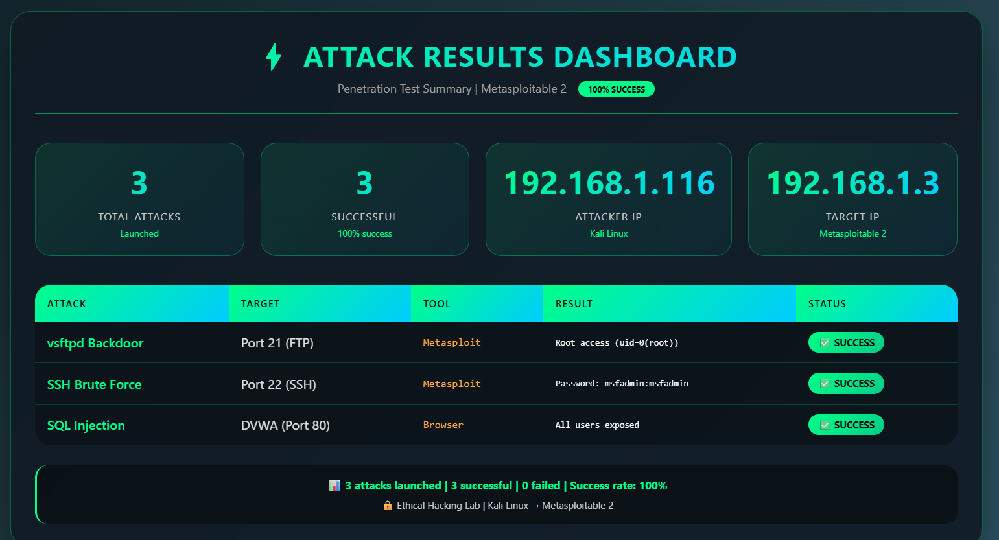

# Ethical Hacking Lab — Metasploitable 2

A hands-on ethical hacking lab where I attacked Metasploitable 2 from Kali Linux. Three critical vulnerabilities were identified and exploited.

## Lab Network

| Machine | IP | Role |
|---------|-----|------|
| Kali Linux | 192.168.1.116 | Attacker |
| Metasploitable 2 | 192.168.1.3 | Target |

---

## Attacks Performed

| Attack | Tool | Result |
|--------|------|--------|
| Network scan | Nmap | 20+ open ports discovered |
| vsftpd 2.3.4 Backdoor (CVE-2011-2523) | Metasploit | Root access (uid=0(root)) |
| SSH Brute Force | Metasploit | Password: msfadmin:msfadmin |
| SQL Injection | Browser (DVWA) | All users exposed |

---

## Attack Details

### 1. vsftpd Backdoor (Port 21)
- **Vulnerability:** vsftpd 2.3.4 backdoor (CVE-2011-2523)
- **Exploit:** Send username with `:)` to port 21 → Backdoor opens on port 6200
- **Result:** Root access via port 6200
- **Note:** Port 6200 is the hidden backdoor port where the root shell is received after triggering the exploit on port 21.
- 

### 2. SSH Brute Force (Port 22)
- **Vulnerability:** Default weak credentials
- **Tool:** Metasploit SSH login scanner
- **Result:** Password discovered: `msfadmin:msfadmin`
- 

### 3. SQL Injection (Port 80)
- **Target:** DVWA (Damn Vulnerable Web Application)
- **Payload:** `1' OR '1'='1`
- **Result:** All user records extracted from database
- 

---

## Defense Measures

| Attack | Defense |
|--------|---------|
| vsftpd Backdoor | Update vsftpd, disable FTP, firewall (block port 21) |
| SSH Brute Force | Strong passwords, fail2ban, change default port |
| SQL Injection | Prepared statements, input validation |

---

## Tools Used

- Kali Linux
- Nmap
- Metasploit Framework
- Hydra
- Firefox (Browser)

---

## Dashboard

A results dashboard was created to summarize all attacks :

---

## Repository Files

- `README.md` – Project documentation
- `dashboard.html` – Attack results dashboard
- `commands.md` – All commands used during the lab
- `screenshots/` – Evidence of all attacks

---

## Author

mariem-ux

## Date

March 2026

## Disclaimer

This lab was conducted in an isolated VirtualBox environment. No real systems were harmed.
